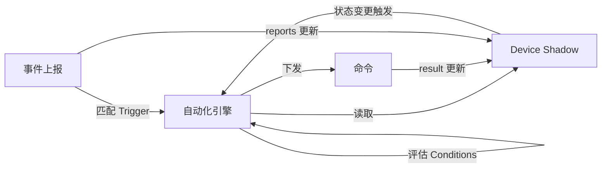

# AI 集成

本文档定义 OHAI 的 AI 集成机制：Schema 到 LLM Tool Calling 的自动映射，以及基于 Adaptive Cards 的设备控制面板。

## 1. Schema 到 LLM Tool Calling 的映射

OHAI Server 将设备 Schema 自动映射为 LLM 的 Tool Calling 定义。由于 Schema 中每条命令的 `params` 使用标准 JSON Schema 描述，与 LLM Tool Calling 的参数定义格式（OpenAI / Anthropic API 均使用 JSON Schema）天然一致，映射过程无需格式转换。

### 1.1 映射规则

| Schema 字段 | LLM Tool 字段 |
|---|---|
| Capability `description` + Command `description` | Tool `description` |
| Command `params`（JSON Schema） | Tool `input_schema` |
| `<capability>:<command>` | Tool `name` |

### 1.2 映射示例

`ohai.brightness:set_brightness` → LLM Tool：

```json
{
  "name": "ohai.brightness:set_brightness",
  "description": "亮度控制 — 设置亮度（绝对值）。影响状态: brightness (当前值: 60%)",
  "input_schema": {
    "type": "object",
    "properties": {
      "brightness": { "type": "integer", "minimum": 0, "maximum": 100 }
    },
    "required": ["brightness"],
    "additionalProperties": false
  }
}
```

Server 在构建 LLM 上下文时，将设备当前 Device Shadow 状态注入 Tool description，使 LLM 在生成绝对目标值时具备充足的上下文信息。

## 2. AI 自动化集成

### 2.1 自动化规则模型：Trigger → Condition → Action

用户通过 Console App 使用自然语言定义自动化规则。Server 中的 Main Agent 通过 LLM 将自然语言解析为结构化规则对象。

**规则结构**：

```jsonc
{
  "rule_id": "rule_001",
  "name": "高温自动开空调",
  "trigger": { /* 触发条件 */ },
  "conditions": [ /* 附加条件（可选） */ ],
  "actions": [ /* 执行动作 */ ]
}
```

### 2.2 Trigger 类型

#### 事件触发（Event Trigger）

当设备上报特定事件时触发：

```jsonc
{
  "type": "event",
  "device_id": "temp_sensor_123",
  "capability": "ohai.sensor.temperature",
  "event": "temperature_update",
  "filter": {
    "field": "params.temperature",
    "operator": "gt",
    "value": 30
  }
}
```

`filter` 使用结构化 JSON 条件表达式。`operator` 从封闭枚举中选取（`eq`、`ne`、`gt`、`gte`、`lt`、`lte`、`in`、`not_in`），`field` 限定为 `params.*` 路径，`value` 限定为 JSON 基本类型。

#### 状态变更触发（State Trigger）

当 Device Shadow 中某个状态值发生变化时触发：

```jsonc
{
  "type": "state_change",
  "device_id": "front_door_lock_789",
  "capability": "ohai.lock",
  "state": "locked",
  "from": true,
  "to": false
}
```

#### 定时触发（Timer Trigger）

基于 Cron 表达式定时触发：

```jsonc
{
  "type": "timer",
  "schedule": "0 7 * * *"       // 每天早上 7 点
}
```

#### 复合触发（Compound Trigger）

多个触发条件的逻辑组合：

```jsonc
{
  "type": "compound",
  "operator": "AND",
  "triggers": [ /* 多个 trigger */ ]
}
```

### 2.3 Condition 评估

Conditions 在 Trigger 命中后执行评估，所有 Conditions 为 true 时才执行 Actions：

```jsonc
"conditions": [
  {
    "type": "state",
    "device_id": "ac_456",
    "capability": "ohai.switch",
    "state": "on",
    "operator": "eq",
    "value": false                    // 空调当前为关闭状态
  },
  {
    "type": "time_window",
    "after": "06:00",
    "before": "23:00"                 // 在 6:00-23:00 之间
  }
]
```

Conditions 从 Device Shadow 读取设备状态，**不直接查询设备**，确保评估速度。

### 2.4 Action 类型

#### 命令下发

```jsonc
{
  "type": "command",
  "device_id": "ac_456",
  "capability": "ohai.thermostat",
  "command": "set_thermostat",
  "params": {
    "target_temp": 24,
    "mode": "cool"
  }
}
```

Server 按命令的 `cmd_type` 选择 QoS 等级下发。

#### 通知推送

```jsonc
{
  "type": "notify",
  "message": "客厅温度超过 30°C，已自动开启空调"
}
```

通过 Client HTTP 推送通知用户。

#### AI 推理

```jsonc
{
  "type": "ai_inference",
  "template": "evaluate_comfort",
  "context": {
    "sensors": ["temp_sensor_123", "humidity_sensor_456"],
    "target_devices": ["ac_789"]
  }
}
```

调用 LLM 进行复杂决策，LLM 可进一步生成命令下发。`template` 从预定义模板库中选取（由 OHAI 或用户在 Console App 中配置），**禁止自由撰写 prompt 文本**。`context` 仅允许传递设备 ID 列表等结构化参数。

### 2.5 状态-事件-命令协作闭环

自动化引擎的核心是 **状态、事件、命令三者的协作循环**：



**完整流程示例**：

1. 温湿度传感器上报 `temperature_update` 事件（`temperature: 32`）
2. 事件声明 `reports: [temperature]` → Server 更新传感器的 Shadow
3. 自动化引擎匹配规则 "温度 > 30°C → 开空调"
4. 读取空调 Shadow 的 `ohai.switch:on` 状态 → `false`（空调当前关闭）
5. Conditions 全部满足 → 执行 Action
6. 下发 `state_cmd:ohai.thermostat:set_thermostat`（`{ "target_temp": 24, "mode": "cool" }`）
7. 空调回复成功 → Server 更新空调的 Shadow
8. 通知 Client："已自动开启空调，目标温度 24°C"

### 2.6 自动化规则完整示例

#### 示例 1：高温自动开空调

"当温湿度传感器上报温度超过 30°C 时，自动打开空调并设置到 22°C。"

```jsonc
{
  "rule_id": "rule_001",
  "name": "高温自动开空调",
  "trigger": {
    "type": "event",
    "device_id": "temp_sensor_123",
    "capability": "ohai.sensor.temperature",
    "event": "temperature_update",
    "filter": {
      "field": "params.temperature",
      "operator": "gt",
      "value": 30
    }
  },
  "conditions": [],
  "actions": [
    {
      "type": "command",
      "device_id": "ac_456",
      "capability": "ohai.thermostat",
      "command": "set_thermostat",
      "params": { "target_temp": 22, "mode": "cool" }
    }
  ]
}
```

#### 示例 2：深夜开门告警

"当门锁被物理切换到开状态，并且当前时间在晚上 10 点到早上 6 点之间时，发送通知并打开客厅主吊灯的夜灯模式。"

```jsonc
{
  "rule_id": "rule_002",
  "name": "深夜开门告警",
  "trigger": {
    "type": "state_change",
    "device_id": "front_door_lock_789",
    "capability": "ohai.lock",
    "state": "locked",
    "from": true,
    "to": false
  },
  "conditions": [
    {
      "type": "time_window",
      "after": "22:00",
      "before": "06:00"
    }
  ],
  "actions": [
    {
      "type": "notify",
      "message": "前门在深夜被打开了！"
    },
    {
      "type": "command",
      "device_id": "living_room_light_123",
      "capability": "ohai.brightness",
      "command": "set_brightness",
      "params": { "brightness": 30 }
    },
    {
      "type": "command",
      "device_id": "living_room_light_123",
      "capability": "ohai.color_temperature",
      "command": "set_color_temp",
      "params": { "color_temp": 2700 }
    }
  ]
}
```

#### 示例 3：每日定时暖房

"每天早上 7 点，如果客厅温度低于 15°C，就打开空调并设置到 24°C，将燃气热水器调整为自动加热模式。"

```jsonc
{
  "rule_id": "rule_003",
  "name": "每日定时暖房",
  "trigger": {
    "type": "timer",
    "schedule": "0 7 * * *"
  },
  "conditions": [
    {
      "type": "state",
      "device_id": "living_room_temp_sensor_123",
      "capability": "ohai.sensor.temperature",
      "state": "temperature",
      "operator": "lt",
      "value": 15
    }
  ],
  "actions": [
    {
      "type": "command",
      "device_id": "ac_456",
      "capability": "ohai.thermostat",
      "command": "set_thermostat",
      "params": { "target_temp": 24, "mode": "heat" }
    },
    {
      "type": "command",
      "device_id": "water_heater_789",
      "capability": "ohai.thermostat",
      "command": "set_thermostat",
      "params": { "mode": "auto" }
    }
  ]
}
```

### 2.7 规则冲突检测

当多条规则可能同时触发并向同一设备发送矛盾的命令时（例如一条规则要开空调制冷，另一条要开制热），Server 采用以下策略：

1. **用户优先级**：用户可以为规则设置优先级（1-10），冲突时高优先级规则优先
2. **冲突告警**：Server 检测到矛盾命令时通知 Client，由用户决定

### 2.8 AI 决策权限控制

OHAI 的能力模型在架构层面已将每个能力设计为单一职责、按能力粒度引用、事件按能力隔离，从根源上避免了某些智能家居平台中"获得设备一个能力即自动获得该设备所有能力"的粗粒度绑定问题。然而，所有由 AI 引擎决策的操作——无论是自动化规则触发的命令，还是 AI 响应用户语音/文本指令时生成的命令——都需要额外的权限约束以遵循**最小特权原则**。

#### 问题：命令风险不对称

同一能力内的命令可能存在风险不对称。例如 `ohai.lock` 的 `set_locked` 命令接受 `locked: boolean` 参数：

- `set_locked({ locked: true })` → 锁门，最坏后果是造成不便（被锁在门外）
- `set_locked({ locked: false })` → 开锁，可能导致非法入侵

用户在编写自动化规则时可能犯错——写出"当某条件满足时自动开门"这样的危险规则，或者在参数中误写 `locked: false`。AI 在响应用户语音指令时也可能因误解或提示词注入而生成危险命令。**安全不能依赖用户自律或 AI 的可靠性，必须由协议层强制保障。**

#### 标准能力中的 AI 安全策略（`ai_policy`）

OHAI 在**标准能力定义本身**中声明每个命令的 AI 安全策略。这是能力 Schema 的一部分，由 OHAI 标准库定义，开发者和用户均无法绕过。`ai_policy` 约束所有由 AI 引擎决策的操作，包括自动化规则执行和 AI 响应用户语音/文本指令生成的命令，不限制用户在 Console App 中直接点击按钮的手动操作。

命令定义中新增 `ai_policy` 字段：

| 策略 | 含义 | AI 决策行为 |
|---|---|---|
| `allow` | 常规操作（默认） | AI 可直接执行 |
| `confirm` | 需要用户确认 | AI 触发时暂停执行，推送确认请求到 Console App，用户确认后才下发 |
| `deny` | 禁止 AI 执行 | Server 无条件拦截，该命令只能由用户在 Console App 中手动操作 |

当 `ai_policy` 需要根据参数值区分安全等级时，使用 `ai_policy_by_params` 进行**参数级策略声明**：

```yaml
ohai.lock:
  description: 门锁控制
  states:
    locked:
      type: boolean
      description: 是否已锁定
  commands:
    set_locked:
      cmd_type: state_cmd
      affects: [locked]
      description: 设置锁定状态
      ai_policy_by_params:
        - when: { locked: true }           # 锁门
          policy: allow                     # 自动化可直接执行
        - when: { locked: false }          # 开锁
          policy: confirm                   # 自动化需用户确认（厂商/用户可通过覆盖升级到 deny）
      params:
        type: object
        properties:
          locked: { type: boolean }
        required: [locked]
        additionalProperties: false
```

`when` 使用 JSON Schema 子集语法匹配参数值。匹配规则：

- 多条 `when` 按声明顺序匹配，**首条命中生效**
- 未命中任何 `when` 的参数组合，**回退到 `confirm`**（安全默认值——未被显式覆盖的参数组合需要用户确认，防止因遗漏 `when` 条件而意外放行危险操作）
- 若开发者希望对未匹配参数使用 `allow`，应添加一条无条件的兜底 `when`（匹配所有参数）
- `ai_policy` 与 `ai_policy_by_params` 可共存，前者作为后者的回退默认值

#### 更多示例

**烤箱**：开启危险、关闭安全

```yaml
example-vendor.oven:
  commands:
    set_on:
      cmd_type: state_cmd
      affects: [on]
      ai_policy_by_params:
        - when: { on: true }               # 开启烤箱
          policy: confirm                   # 自动化需用户确认
        - when: { on: false }              # 关闭烤箱
          policy: allow                     # 自动化可直接执行
```

**温控**：正常范围自动化可执行，极端值需确认

```yaml
ohai.thermostat:
  commands:
    set_thermostat:
      cmd_type: state_cmd
      affects: [target_temp, mode]
      ai_policy: allow              # 默认允许
      ai_policy_by_params:
        - when:                             # 目标温度超过 35°C
            target_temp: { minimum: 35 }
          policy: confirm                   # 需要用户确认
```

#### Server 端程序化校验

安全策略的执行完全在 Server 端，AI 引擎和自动化规则无法绕过：

**规则创建时（静态分析）**：

1. Server 解析规则中每个 Action 的 `capability` + `command` + `params`
2. 将参数与对应命令的 `ai_policy_by_params` 逐条匹配
3. 如果参数是硬编码值且命中 `deny` 策略 → **拒绝创建规则**，返回错误提示告知用户该操作禁止 AI 执行
4. 如果参数是硬编码值且命中 `confirm` 策略 → 允许创建，标记该 Action 为"需确认"

**AI 命令下发时（运行时拦截，适用于自动化规则和 AI 响应用户指令）**：

1. Server 在下发每条由 AI 引擎决策的命令前，将**实际参数**与 `ai_policy_by_params` 匹配
2. 命中 `deny` → **拦截**，不下发命令，记录安全日志，通知用户
3. 命中 `confirm` → **暂停**，推送确认请求到 Console App，等待用户确认后下发（超时则取消）
4. 命中 `allow` → 正常下发；未命中任何 `when`（仅当存在 `ai_policy_by_params` 时）→ 回退到 `confirm`

```
自动化规则创建 ──► 解析 Actions ──► 匹配 ai_policy ──► deny: 拒绝创建
                                                        ──► confirm: 标记需确认
                                                        ──► allow: 正常存储

AI 命令下发 ──► 组装参数 ──► 匹配 ai_policy ──► deny: 拦截 + 通知
（自动化 / AI 响应指令）                          ──► confirm: 暂停 + 等待确认
                                                  ──► allow: 下发命令
```

运行时校验对动态参数（如引用触发事件中的数据）尤为关键——创建时的静态分析无法覆盖所有运行时值。

#### 设计原则

1. **标准能力定义安全下限**：`ai_policy` 写在 `ohai.*` 标准能力库中，设定每条命令的最低安全等级。厂商和用户只能在此基础上升级策略，不能降级
2. **默认安全**：标准能力中安全敏感的命令/参数组合默认标记为 `deny` 或 `confirm`，用户不做任何配置也能获得保护
3. **厂商自定义能力同样适用**：厂商在自定义能力中声明 `ai_policy`，Server 统一执行。未声明策略的命令默认为 `allow`
4. **用户手动操作不受限制**：`ai_policy` 约束所有由 AI 引擎决策的操作（自动化规则执行、AI 响应语音/文本指令）。用户在 Console App 中直接点击按钮手动操作设备时，所有命令均可执行（通过 [5.1 节](#_5-1-命令下发完整生命周期)的正常命令流程下发）

#### 三层策略覆盖模型

`ai_policy` 的生效策略由三层叠加决定，每层只能升级（加严）不能降级（放宽）：

```
effective_policy = max(standard_policy, vendor_override, user_override)

策略严格度排序：allow < confirm < deny
```

| 层级 | 时机 | 谁设置 | 存储位置 |
|---|---|---|---|
| **标准能力定义** | 协议设计时 | OHAI 标准库 | 标准能力库（安全下限，不可降级） |
| **厂商 Schema 覆盖** | 设备注册时 | 设备开发者 | 设备 `schema.json` 的 `overrides.commands` |
| **用户设备配置** | 运行时 | 用户（Console App） | Server 端设备配置数据库 |

**厂商覆盖**通过 Schema `overrides` 机制实现（详见 [设备 Schema 规范 - Capability 引用与定义](./schema.md#_2-capability-引用与定义)），在设备注册时由 Server 校验并合并。

**用户覆盖**通过 Console App 的设备设置界面配置。Console App 展示该设备所有命令的当前生效策略（`max(standard, vendor)`），用户只能选择当前值或更严格的值。覆盖存储在 Server 端设备配置中，不影响设备 Schema。

**示例**：

```
ohai.lock — set_locked
├── locked: true
│   ├── 标准定义:    allow
│   ├── 厂商覆盖:    (无)
│   ├── 用户覆盖:    (无)
│   └── 生效策略:    allow
│
└── locked: false
    ├── 标准定义:    confirm
    ├── 厂商覆盖:    deny     ← 高安全门锁厂商升级
    ├── 用户覆盖:    (无)
    └── 生效策略:    deny      = max(confirm, deny)
```