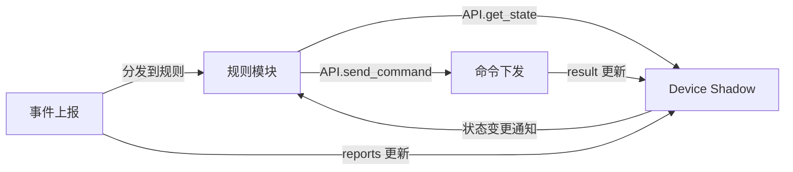

# AI 集成

本文档定义 OHAI 的 AI 集成机制：Schema 到 LLM Tool Calling 的自动映射，以及基于 Adaptive Cards 的设备控制面板。

## 1. Schema 到 LLM Tool Calling 的映射

OHAI Server 将设备 Schema 自动映射为 LLM 的 Tool Calling 定义。由于 Schema 中每条命令的 `params` 使用标准 JSON Schema 描述，与 LLM Tool Calling 的参数定义格式（OpenAI / Anthropic API 均使用 JSON Schema）天然一致，映射过程无需格式转换。

### 1.1 映射规则

| Schema 字段 | LLM Tool 字段 |
|---|---|
| Capability `description` + Command `description` | Tool `description` |
| Command `params`（JSON Schema） | Tool `input_schema` |
| `<capability>:<command>` | Tool `name` |

### 1.2 映射示例

`ohai.brightness:set_brightness` → LLM Tool：

```json
{
  "name": "ohai.brightness:set_brightness",
  "description": "亮度控制 — 设置亮度（绝对值）。影响状态: brightness (当前值: 60%)",
  "input_schema": {
    "type": "object",
    "properties": {
      "brightness": { "type": "integer", "minimum": 0, "maximum": 100 }
    },
    "required": ["brightness"],
    "additionalProperties": false
  }
}
```

Server 在构建 LLM 上下文时，将设备当前 Device Shadow 状态注入 Tool description，使 LLM 在生成绝对目标值时具备充足的上下文信息。

## 2. AI 自动化集成

### 2.1 设计理念：为什么用 Elixir 代码模块？

OHAI 的自动化规则由 Main Agent 的 LLM **从用户的自然语言描述自动生成 Elixir 代码模块**。每条规则是一个独立的 Elixir 模块，遵循预定义的 `OHAI.Rule` 模板，可调用系统提供的 API。

#### 为何不用 JSON DSL？

传统智能家居平台使用 JSON 格式的 Trigger → Condition → Action 规则。这种方式看似简洁，但在面对真实家庭场景时表达力严重不足：

| 常见需求 | JSON DSL 的困境 |
|---|---|
| 温度**持续** >30°C **超过 5 分钟**才开空调 | 无持续时间/防抖语义，传感器波动导致设备频繁开关 |
| 无人 **30 分钟后**关灯 | 无法表达"状态未变化持续 N 时间"，无延迟执行 |
| 空调设到**比室温低 4 度** | Action 参数只能硬编码，无法引用传感器数据动态计算 |
| **日落后**开灯 | Cron 表达式无法表达天文时间（日落时间每天不同） |
| **所有窗户都关闭**才开空调 | 条件检查只能逐个设备 AND，缺少聚合能力 |
| 门锁**连续 3 次输错密码**告警 | 无事件历史计数 |
| 灯光从 100% **渐变到** 30% | 无分步渐变动作 |
| 根据**一周用电历史**推荐节能设置 | 无法查询历史数据 |

每增加一种新需求就要扩展 DSL 语法——这是一个永无止境的过程。而 OHAI 的规则由 LLM 从自然语言生成，LLM 天然擅长生成代码。**直接生成 Elixir 代码模块，任何可用 Elixir 表达的逻辑都可以成为规则**，无需为每种模式设计专用语法。

#### 信任模型：规则代码 vs 设备 Pads

规则代码与设备 Pads（详见 [AI Agent 能力探测协议 - Pads](./secure-capability-prob.md#agent-pads：编译式格式适配器)）虽然都是 LLM 生成的 Elixir 代码，但信任等级不同：

| 维度 | 设备 Pads | 自动化规则 |
|---|---|---|
| 代码来源 | Sub Agent LLM（不受信任的设备厂商） | Main Agent LLM（代表用户） |
| 攻击者模型 | 恶意厂商可能有意注入攻击代码 | LLM 幻觉 / 用户 prompt 被注入（非恶意） |
| 允许的调用范围 | 极窄（纯数据转换模块） | 较宽（数据操作 + 时间 + 系统设备 API + 历史查询 + 环境数据） |
| 安全目标 | 防止恶意代码逃逸到 Main Agent | 防止 LLM 错误生成有害代码（安全网） |

**核心原则**：用户已经授权 LLM 通过自然语言控制家中设备（Tool Calling），LLM 代表用户生成控制设备的代码是**同等信任等级**。AST 调用范围检查是防御 LLM 幻觉的安全网，而非防御恶意攻击者。

### 2.2 规则模块模板

每条规则是一个 Elixir 模块，通过 `use OHAI.Rule` 引入 DSL 宏和回调机制。

#### 模块结构

```elixir
defmodule OHAI.Rules.MyRule do
  use OHAI.Rule

  @rule_name "规则名称"
  @description "用户可读的自然语言描述"

  # ── 声明式 DSL（简单规则的首选方式）──

  # 事件触发
  on_event "device_id", "capability", :event_name do
    # params 变量自动绑定事件参数
    # 此处编写逻辑...
  end

  # 状态变更触发
  on_state_change "device_id", "capability", :state_key do
    # old_value, new_value 变量自动绑定
    # 此处编写逻辑...
  end

  # 定时触发
  on_timer :timer_name do
    # 此处编写逻辑...
  end

  # ── 标准回调（复杂有状态逻辑时使用）──

  # 初始化回调（可选），用于设置初始状态和定时器
  def init do
    API.schedule_cron(:morning_check, "0 7 * * *")
  end

  # 通用事件处理回调（可选），处理 on_event 未覆盖的事件
  def handle_event(device_id, capability, event_name, params) do
    # ...
  end
end
```

#### DSL 宏说明

| 宏 | 用途 | 自动绑定的变量 |
|---|---|---|
| `on_event device, cap, event` | 设备上报特定事件时执行 | `params`（事件参数 map） |
| `on_state_change device, cap, state` | Device Shadow 中特定状态值变化时执行 | `old_value`、`new_value` |
| `on_timer name` | 命名定时器到期时执行 | 无 |

`on_event` 和 `on_state_change` 支持 `when` guard 进行条件过滤：

```elixir
on_event "temp_sensor", "ohai.sensor.temperature", :temperature_update,
  when: params.temperature > 30 do
  # 仅在温度 > 30 时执行
end
```

### 2.3 系统 API

规则通过 `OHAI.Rule.API`（在规则模块中简写为 `API`）访问系统功能。**所有设备操作和外部访问都通过此 API 进行，规则代码不直接访问 MQTT、数据库或底层网络库。**

#### 设备控制

```elixir
# 下发命令（内部强制执行 ai_policy 检查）
API.send_command(device_id, capability, command, params)
# 示例
API.send_command("ac_456", "ohai.thermostat", "set_thermostat",
  %{target_temp: 24, mode: "cool"})
```

`send_command` 内部执行完整的 `ai_policy` 校验流程——无论规则代码如何构造参数，最终都经过策略匹配（详见 [2.8 AI 决策权限控制](#_2-8-ai-决策权限控制)）。

#### 状态读取

```elixir
# 从 Device Shadow 读取当前状态
API.get_state(device_id, capability, state_key)
# 示例
temp = API.get_state("temp_sensor_123", "ohai.sensor.temperature", :temperature)
# => 28.5
```

#### 历史数据查询

```elixir
# 查询设备历史状态/事件数据
API.query_history(device_id, capability, state_or_event, time_range)
# 示例：查询过去 7 天的能耗数据
history = API.query_history("smart_plug_1", "ohai.energy_meter", :energy,
  last: {7, :days})
# => [%{timestamp: ~U[...], value: 12.3}, ...]
```

#### 通知

```elixir
# 推送通知到 Console App
API.notify(message)
# 示例
API.notify("客厅温度 #{temp}°C 持续偏高，已自动开启空调制冷")
```

#### 定时器

```elixir
# 命名定时器（同名调用自动覆盖前一个，天然防抖）
API.schedule_after(:timer_name, delay_ms)

# Cron 定时器
API.schedule_cron(:timer_name, "0 7 * * *")

# 取消定时器
API.cancel_timer(:timer_name)
```

命名定时器的关键特性：**同名调用覆盖**。当 `schedule_after(:check, 5000)` 被重复调用时，前一个定时器自动取消，只有最后一次调用的定时器生效。这天然实现了防抖（debounce）——无需额外逻辑。

#### 规则私有状态

```elixir
# 读写规则的私有状态（跨事件持久化，规则间隔离）
API.put_rule_state(:fail_count, 3)
count = API.get_rule_state(:fail_count)  # => 3
```

#### 环境信息

```elixir
# 日出日落时间（基于用户配置的地理位置）
{sunrise, sunset} = API.sun_times(Date.utc_today())
# => {~T[06:23:00], ~T[18:45:00]}

# 用户地理位置
{lat, lng} = API.location()
```

#### 环境数据

```elixir
# 天气预报（Server 内置数据服务，返回结构化数据）
API.weather(:current)
# => %{temp: 32, humidity: 65, condition: :sunny}

API.weather(:forecast, hours: 6)
# => [%{hour: 14, temp: 35, condition: :sunny},
#     %{hour: 15, temp: 33, condition: :cloudy}, ...]

# 电价（动态电价市场适用）
API.electricity_price(:current)
# => %{price: 0.52, unit: :yuan_per_kwh, tier: :peak}

API.electricity_price(:schedule, hours: 24)
# => [%{hour: 0, price: 0.28, tier: :off_peak}, ...]
```

环境数据服务的安全模型：

- **数据源由 OHAI 标准枚举定义**：只有标准定义的数据类型（天气、电价等），不可由第三方扩展
- **Server 负责获取和缓存**：规则代码无网络访问权，数据获取完全由 Server 在规则沙箱之外完成
- **返回值是封闭的结构化类型**：与设备 Schema 的类型约束同等严格（数值、枚举，无自由文本），防止数据中的提示词注入
- **数据源 URL 由用户配置**：用户在 Console App 中选择数据服务商（如气象 API 提供者），但返回值的结构由 OHAI 标准固定
- **Server 端值域校验**：Server 对外部 API 返回值进行 range check（如温度 -60°C ~ 60°C），超出合理范围的值被丢弃并记录异常日志
- **不可用时降级**：数据源不可用时 API 返回 `nil`，规则必须处理缺失数据的情况

#### API 速查表

| 分类 | 函数 | 说明 |
|---|---|---|
| 设备控制 | `send_command(device, cap, cmd, params)` | 下发命令（强制 ai_policy） |
| 状态读取 | `get_state(device, cap, state_key)` | 读取 Device Shadow |
| 历史查询 | `query_history(device, cap, key, range)` | 查询历史数据 |
| 通知 | `notify(message)` | 推送通知到 Console App |
| 定时器 | `schedule_after(name, delay_ms)` | 延迟定时器（同名覆盖 = 防抖） |
| 定时器 | `schedule_cron(name, cron_expr)` | Cron 定时器 |
| 定时器 | `cancel_timer(name)` | 取消定时器 |
| 规则状态 | `get_rule_state(key)` / `put_rule_state(key, val)` | 规则私有状态 |
| 环境 | `sun_times(date)` | 日出日落时间 |
| 环境 | `location()` | 用户地理位置 |
| 环境 | `weather(type, opts \\ [])` | 天气实况/预报（Server 内置数据服务） |
| 环境 | `electricity_price(type, opts \\ [])` | 电价实况/时段表（Server 内置数据服务） |

### 2.4 规则安全模型

#### AST 调用范围检查

规则代码在编译加载前，Server 对 Elixir 源码进行 AST 解析，执行**白名单校验**。与设备 Pads 的白名单机制（详见 [Pads 安全性](./secure-capability-prob.md#pads-安全性：ast-级静态分析)）原理相同，但允许范围更宽：

**允许的模块：**

```elixir
@allowed_modules [
  # OHAI 系统 API
  OHAI.Rule.API,

  # Elixir 标准库 — 数据操作
  Enum, List, Map, Keyword, Tuple, MapSet, Stream, Range,
  String, Integer, Float, Regex, Base, URI,

  # 日期时间
  DateTime, NaiveDateTime, Date, Time, Calendar,

  # 数学
  :math,

  # JSON
  :json,

  # 日志
  Logger
]
```

**禁止的模块/语法：**

| 类别 | 禁止项 | 原因 |
|---|---|---|
| 网络 I/O | `HTTPoison`、`:httpc`、`:gen_tcp`、`:ssl`、`Req`、`Finch` 等 | 规则不应直接访问网络（通过 Server 内置环境数据 API 间接获取） |
| 文件系统 | `File`、`Path`、`IO` | 规则不应访问文件系统 |
| 进程操作 | `Process`、`GenServer`、`Agent`、`Task`、`spawn`、`send/2`、`receive` | 进程操作由系统 API 封装 |
| 系统调用 | `System`、`:os`、`:erlang.open_port` | 禁止系统级操作 |
| 代码加载 | `Code`、`:code`、`Module`、`defmacro` | 禁止动态代码执行和元编程 |
| 存储 | `:ets`、`:dets`、`Mnesia` | 规则状态由 API 管理 |
| 危险语法 | `apply/3`、`:erlang.*` 原子调用、`String.to_atom/1` | 防止白名单绕过和 atom 泄漏 |

#### 供应链安全：禁止第三方依赖

LLM 生成规则代码时，**禁止引入任何第三方库**。规则代码只能使用 OHAI Server 内置的模块（上述白名单）。

这一限制的根本原因是防御**供应链投毒攻击**：如果 LLM 在生成规则时引用了第三方 Hex 包，而该包被攻击者投毒，恶意代码将在用户不知情的情况下在 Server 上执行。与 Web 应用不同，智能家居系统控制着用户的物理环境（门锁、电器、摄像头），供应链攻击的后果远比数据泄露严重。

Server 通过以下机制强制执行此限制：

- **AST 白名单**：规则代码的模块调用严格限制在白名单范围内，任何非白名单模块的调用在编译前即被拒绝
- **无包管理器访问**：规则编译环境不包含 Mix/Hex 客户端，LLM 生成的任何 `Mix.install` 或依赖声明无法执行
- **编译隔离**：规则在受限的编译环境中编译，只能使用 Server 预装的 BEAM 模块

#### 与 Pads 安全模型的对比

| 维度 | Pads（设备侧） | 规则（用户侧） |
|---|---|---|
| 白名单范围 | 13 个纯数据转换模块 | ~20 个模块 + OHAI.Rule.API |
| 定时器 | 不允许 | 允许（通过 `API.schedule_after`） |
| 设备控制 | 不允许 | 允许（通过 `API.send_command`） |
| 历史数据 | 不允许 | 允许（通过 `API.query_history`） |
| 日期时间 | 不允许 | 允许（`DateTime` 等） |
| 网络 I/O | 禁止 | 禁止（通过 Server 内置环境数据 API 间接获取） |
| 文件/系统 | 禁止 | 禁止 |
| 进程原语 | 禁止 | 禁止（由 API 封装） |

#### ai_policy 在 API 层强制执行

`OHAI.Rule.API.send_command/4` 内部强制执行 `ai_policy` 检查——无论规则代码如何构造参数，最终调用 API 时都会经过策略匹配。这比 JSON DSL 的静态分析**更可靠**，因为能覆盖所有动态参数组合：

```
规则代码调用 API.send_command(device, cap, cmd, params)
  └→ Server 将实际参数与 ai_policy_by_params 逐条匹配
      ├→ deny:    拦截 + 安全日志 + 通知用户
      ├→ confirm: 暂停 + 推送确认请求到 Console App + 等待用户确认
      └→ allow:   正常下发命令
```

#### 资源限制

| 防护 | 机制 |
|---|---|
| 内存耗尽 | 每条规则运行在独立 BEAM 进程，设置进程内存上限 |
| 死循环 | 事件处理设置执行超时，超时则终止本次执行并记录日志 |
| 设备轰炸 | `send_command` API 内置 rate limiting（同一设备同一命令的调用频率限制） |
| 规则间干扰 | BEAM 进程隔离，规则间无法直接通信 |

#### 潜在风险分析

| 风险 | 缓解措施 |
|---|---|
| LLM 幻觉生成调用不存在的 API | AST 白名单拒绝非法调用 + Elixir 编译期报错 |
| 用户 prompt 被注入导致恶意代码 | AST 白名单确保即使代码"恶意"也无法逃逸（无网络/文件/系统访问） |
| 资源耗尽（死循环/巨大数据结构） | 规则进程独立，内存上限 + 执行超时 |
| 规则频繁下发命令 | API 层 rate limiting |
| 用户无法理解生成的代码 | Console App 同时展示自然语言描述和代码；提供 dry run 模式 |
| LLM 引入被投毒的第三方库 | 禁止第三方依赖，AST 白名单 + 无包管理器访问 + 编译隔离 |
| 环境数据源返回错误数据 | Server 端值域校验 + 数据不可用时 API 返回 nil + 数据源不可第三方扩展 |

### 2.5 规则生命周期

#### 创建

```
用户在 Console App 输入自然语言描述
  → Main Agent LLM 生成 Elixir 规则模块
    → Server AST 校验（白名单检查）
      → Elixir 编译
        → 加载到规则引擎
          → 规则开始运行
```

Console App 同时向用户展示**自然语言描述**和**生成的 Elixir 代码**。用户确认后规则生效。

#### 状态管理

- **启用/禁用**：用户可在 Console App 中临时禁用规则而不删除，禁用后规则进程挂起，不再接收事件
- **删除**：规则进程终止，模块卸载
- **优先级**：用户可为规则设置优先级（1-10），用于冲突检测时仲裁

#### 热更新

用户修改规则的自然语言描述后，LLM 重新生成代码，经 AST 校验和编译后热替换旧模块。BEAM VM 的热代码加载确保规则更新不影响其他规则的运行。

### 2.6 状态-事件-命令协作闭环

自动化引擎的核心是 **状态、事件、命令三者的协作循环**：



**完整流程示例**：

1. 温湿度传感器上报 `temperature_update` 事件（`temperature: 32`）
2. 事件声明 `reports: [temperature]` → Server 更新传感器的 Shadow
3. 规则引擎将事件分发到所有订阅了该设备该事件的规则模块
4. 规则模块执行逻辑：读取空调 Shadow → 空调当前关闭 → 调用 `API.send_command` 开空调
5. `send_command` 内部匹配 `ai_policy` → `allow` → 下发命令
6. 空调回复成功 → Server 更新空调的 Shadow
7. 规则调用 `API.notify` → 通知用户 "已自动开启空调"

### 2.7 自动化规则完整示例

#### 示例 1：高温持续 5 分钟开空调

"当温度持续超过 30°C 超过 5 分钟，自动打开空调，目标温度设为比当前温度低 6 度。"

```elixir
defmodule OHAI.Rules.HighTempAC do
  use OHAI.Rule

  @rule_name "高温自动开空调"
  @description "当温度持续超过 30°C 超过 5 分钟，自动打开空调制冷"

  on_event "temp_sensor_123", "ohai.sensor.temperature", :temperature_update do
    if params.temperature > 30 do
      # 同名定时器自动覆盖 = 天然防抖
      API.schedule_after(:high_temp_check, :timer.minutes(5))
    else
      API.cancel_timer(:high_temp_check)
    end
  end

  on_timer :high_temp_check do
    temp = API.get_state("temp_sensor_123", "ohai.sensor.temperature", :temperature)

    if temp > 30 do
      API.send_command("ac_456", "ohai.thermostat", "set_thermostat",
        %{target_temp: temp - 6, mode: "cool"})
      API.notify("温度 #{temp}°C 持续偏高，已自动开启空调制冷")
    end
  end
end
```

**要点**：`schedule_after` 的同名覆盖特性实现了防抖——5 分钟内每次温度上报都重置计时器，只有持续超过 30°C 满 5 分钟才真正触发。动态参数 `temp - 6` 使目标温度自适应当前室温。

#### 示例 2：深夜开门告警

"当门锁状态从锁定变为解锁，如果当前时间在晚上 10 点到早上 6 点之间，发送通知并打开客厅夜灯模式。"

```elixir
defmodule OHAI.Rules.NightDoorAlert do
  use OHAI.Rule

  @rule_name "深夜开门告警"
  @description "深夜门锁解锁时告警并开夜灯"

  on_state_change "front_door_lock_789", "ohai.lock", :locked do
    if old_value == true and new_value == false do
      hour = Time.utc_now().hour

      if hour >= 22 or hour < 6 do
        API.notify("前门在深夜被打开了！")
        API.send_command("living_room_light_123", "ohai.brightness",
          "set_brightness", %{brightness: 30})
        API.send_command("living_room_light_123", "ohai.color_temperature",
          "set_color_temp", %{color_temp: 2700})
      end
    end
  end
end
```

#### 示例 3：无人 30 分钟自动关灯

"人体传感器检测到运动时开灯；30 分钟没有检测到运动则自动关灯。"

```elixir
defmodule OHAI.Rules.AutoLightOff do
  use OHAI.Rule

  @rule_name "无人自动关灯"
  @description "检测到运动开灯，30 分钟无人后自动关灯"

  on_event "motion_sensor_101", "ohai.sensor.motion", :motion_update do
    if params.motion_detected do
      # 有人 → 开灯 + 重置关灯计时器
      API.send_command("room_light_201", "ohai.switch", "set_on", %{on: true})
      API.schedule_after(:no_motion_off, :timer.minutes(30))
    end
  end

  on_timer :no_motion_off do
    # 30 分钟内没有新的运动事件（否则计时器已被 schedule_after 覆盖重置）
    API.send_command("room_light_201", "ohai.switch", "set_on", %{on: false})
  end
end
```

**要点**：每次检测到运动都调用 `schedule_after(:no_motion_off, ...)`，同名定时器自动覆盖前一个，实现了"最后一次运动后 30 分钟"的精确语义。

#### 示例 4：日落开灯 + 日出关灯

"日落后自动开客厅灯，日出时自动关灯。"

```elixir
defmodule OHAI.Rules.SunlightAutomation do
  use OHAI.Rule

  @rule_name "日出日落自动灯光"
  @description "日落开灯，日出关灯"

  def init do
    schedule_next_sun_event()
  end

  on_timer :sunset_on do
    API.send_command("living_room_light", "ohai.switch", "set_on", %{on: true})
    API.send_command("living_room_light", "ohai.brightness",
      "set_brightness", %{brightness: 80})
    schedule_next_sun_event()
  end

  on_timer :sunrise_off do
    API.send_command("living_room_light", "ohai.switch", "set_on", %{on: false})
    schedule_next_sun_event()
  end

  defp schedule_next_sun_event do
    {sunrise, sunset} = API.sun_times(Date.utc_today())
    now = Time.utc_now()

    cond do
      Time.compare(now, sunset) == :lt ->
        delay = Time.diff(sunset, now, :millisecond)
        API.schedule_after(:sunset_on, delay)
      Time.compare(now, sunrise) == :lt ->
        delay = Time.diff(sunrise, now, :millisecond)
        API.schedule_after(:sunrise_off, delay)
      true ->
        # 今天的日出日落都已过，安排明天的
        {sunrise_tomorrow, _} = API.sun_times(Date.add(Date.utc_today(), 1))
        delay = Time.diff(sunrise_tomorrow, now, :millisecond) + 86_400_000
        API.schedule_after(:sunrise_off, delay)
    end
  end
end
```

**要点**：`API.sun_times/1` 根据用户配置的地理位置计算天文时间。规则在 `init` 时和每次执行后重新计算下一个事件时间，适应日出日落的日变化。

#### 示例 5：基于历史数据的节能推荐

"分析过去一周的空调使用数据，如果每天运行超过 8 小时且目标温度一直低于 24°C，建议用户将目标温度提高 2 度以节能。"

```elixir
defmodule OHAI.Rules.EnergySavingAdvice do
  use OHAI.Rule

  @rule_name "节能建议"
  @description "根据空调使用历史推荐节能设置"

  def init do
    API.schedule_cron(:weekly_analysis, "0 9 * * 1")  # 每周一早上 9 点
  end

  on_timer :weekly_analysis do
    history = API.query_history("ac_456", "ohai.thermostat", :target_temp,
      last: {7, :days})

    if length(history) > 0 do
      avg_temp = Enum.sum(Enum.map(history, & &1.value)) / length(history)
      daily_hours = estimate_daily_runtime(history)

      if daily_hours > 8 and avg_temp < 24 do
        API.notify(
          "过去一周空调日均运行 #{Float.round(daily_hours, 1)} 小时，" <>
          "平均目标温度 #{Float.round(avg_temp, 1)}°C。" <>
          "建议将目标温度提高 2°C 至 #{Float.round(avg_temp + 2, 1)}°C，预计可节能 10-15%。"
        )
      end
    end
  end

  defp estimate_daily_runtime(history) do
    # 根据状态变更记录估算每天运行时长
    total_entries = length(history)
    # 简化计算：非零温度记录数 / 每小时采样频率 / 天数
    total_entries / 6 / 7
  end
end
```

**要点**：`API.query_history/4` 使规则能够分析设备的历史使用模式。这是 AI 自动生成节能/舒适度优化规则的基础——系统可以从历史数据中发现用户习惯，自动生成类似规则并推荐给用户。

### 2.8 规则冲突检测

当多条规则可能同时触发并向同一设备发送矛盾的命令时（例如一条规则要开空调制冷，另一条要开制热），Server 采用以下策略：

1. **用户优先级**：用户可以为规则设置优先级（1-10），冲突时高优先级规则优先
2. **运行时冲突检测**：`API.send_command` 在执行前检查是否有其他规则在短时间窗口内向同一设备的同一能力下发了矛盾命令，如检测到则暂停后到达的命令并通知用户
3. **冲突告警**：Server 检测到矛盾命令时通知 Console App，由用户决定

### 2.9 AI 决策权限控制

OHAI 的能力模型在架构层面已将每个能力设计为单一职责、按能力粒度引用、事件按能力隔离，从根源上避免了某些智能家居平台中"获得设备一个能力即自动获得该设备所有能力"的粗粒度绑定问题。然而，所有由 AI 引擎决策的操作——无论是自动化规则触发的命令，还是 AI 响应用户语音/文本指令时生成的命令——都需要额外的权限约束以遵循**最小特权原则**。

#### 问题：命令风险不对称

同一能力内的命令可能存在风险不对称。例如 `ohai.lock` 的 `set_locked` 命令接受 `locked: boolean` 参数：

- `set_locked({ locked: true })` → 锁门，最坏后果是造成不便（被锁在门外）
- `set_locked({ locked: false })` → 开锁，可能导致非法入侵

用户在编写自动化规则时可能犯错——写出"当某条件满足时自动开门"这样的危险规则，或者在参数中误写 `locked: false`。AI 在响应用户语音指令时也可能因误解或提示词注入而生成危险命令。**安全不能依赖用户自律或 AI 的可靠性，必须由协议层强制保障。**

#### 标准能力中的 AI 安全策略（`ai_policy`）

OHAI 在**标准能力定义本身**中声明每个命令的 AI 安全策略。这是能力 Schema 的一部分，由 OHAI 标准库定义，开发者和用户均无法绕过。`ai_policy` 约束所有由 AI 引擎决策的操作，包括自动化规则执行和 AI 响应用户语音/文本指令生成的命令，不限制用户在 Console App 中直接点击按钮的手动操作。

命令定义中新增 `ai_policy` 字段：

| 策略 | 含义 | AI 决策行为 |
|---|---|---|
| `allow` | 常规操作（默认） | AI 可直接执行 |
| `confirm` | 需要用户确认 | AI 触发时暂停执行，推送确认请求到 Console App，用户确认后才下发 |
| `deny` | 禁止 AI 执行 | Server 无条件拦截，该命令只能由用户在 Console App 中手动操作 |

当 `ai_policy` 需要根据参数值区分安全等级时，使用 `ai_policy_by_params` 进行**参数级策略声明**：

```yaml
ohai.lock:
  description: 门锁控制
  states:
    locked:
      type: boolean
      description: 是否已锁定
  commands:
    set_locked:
      cmd_type: state_cmd
      affects: [locked]
      description: 设置锁定状态
      ai_policy_by_params:
        - when: { locked: true }           # 锁门
          policy: allow                     # 自动化可直接执行
        - when: { locked: false }          # 开锁
          policy: confirm                   # 自动化需用户确认（厂商/用户可通过覆盖升级到 deny）
      params:
        type: object
        properties:
          locked: { type: boolean }
        required: [locked]
        additionalProperties: false
```

`when` 使用 JSON Schema 子集语法匹配参数值。匹配规则：

- 多条 `when` 按声明顺序匹配，**首条命中生效**
- 未命中任何 `when` 的参数组合，**回退到 `confirm`**（安全默认值——未被显式覆盖的参数组合需要用户确认，防止因遗漏 `when` 条件而意外放行危险操作）
- 若开发者希望对未匹配参数使用 `allow`，应添加一条无条件的兜底 `when`（匹配所有参数）
- `ai_policy` 与 `ai_policy_by_params` 可共存，前者作为后者的回退默认值

#### 更多示例

**烤箱**：开启危险、关闭安全

```yaml
example-vendor.oven:
  commands:
    set_on:
      cmd_type: state_cmd
      affects: [on]
      ai_policy_by_params:
        - when: { on: true }               # 开启烤箱
          policy: confirm                   # 自动化需用户确认
        - when: { on: false }              # 关闭烤箱
          policy: allow                     # 自动化可直接执行
```

**温控**：正常范围自动化可执行，极端值需确认

```yaml
ohai.thermostat:
  commands:
    set_thermostat:
      cmd_type: state_cmd
      affects: [target_temp, mode]
      ai_policy: allow              # 默认允许
      ai_policy_by_params:
        - when:                             # 目标温度超过 35°C
            target_temp: { minimum: 35 }
          policy: confirm                   # 需要用户确认
```

#### Server 端 API 层强制执行

安全策略的执行完全在 Server 端的 `OHAI.Rule.API.send_command/4` 内部，自动化规则和 AI 响应指令均无法绕过。

由于自动化规则使用 Elixir 代码模块（参数可能是动态计算的），静态分析无法覆盖所有运行时参数组合。因此 `ai_policy` 的执行统一在**运行时 API 层**：

1. 规则代码或 AI 引擎调用 `API.send_command(device, cap, cmd, params)`
2. Server 将**实际参数**与 `ai_policy_by_params` 逐条匹配
3. 命中 `deny` → **拦截**，不下发命令，记录安全日志，通知用户
4. 命中 `confirm` → **暂停**，推送确认请求到 Console App，等待用户确认后下发（超时则取消）
5. 命中 `allow` → 正常下发；未命中任何 `when`（仅当存在 `ai_policy_by_params` 时）→ 回退到 `confirm`

```
API.send_command(device, cap, cmd, params)
  └→ 将实际参数与 ai_policy_by_params 匹配
      ├→ deny:    拦截 + 安全日志 + 通知用户
      ├→ confirm: 暂停 + 推送确认到 Console App + 等待确认
      └→ allow:   正常下发命令
```

这种 API 层运行时拦截对动态参数天然有效——无论规则代码如何构造参数（硬编码、从传感器读取、从历史数据计算），最终都经过策略匹配。

#### 设计原则

1. **标准能力定义安全下限**：`ai_policy` 写在 `ohai.*` 标准能力库中，设定每条命令的最低安全等级。厂商和用户只能在此基础上升级策略，不能降级
2. **默认安全**：标准能力中安全敏感的命令/参数组合默认标记为 `deny` 或 `confirm`，用户不做任何配置也能获得保护
3. **厂商自定义能力同样适用**：厂商在自定义能力中声明 `ai_policy`，Server 统一执行。未声明策略的命令默认为 `allow`
4. **用户手动操作不受限制**：`ai_policy` 约束所有由 AI 引擎决策的操作（自动化规则中 `API.send_command` 的调用、AI 响应语音/文本指令生成的命令）。用户在 Console App 中直接点击按钮手动操作设备时，所有命令均可执行，不经过 `ai_policy` 检查

#### 三层策略覆盖模型

`ai_policy` 的生效策略由三层叠加决定，每层只能升级（加严）不能降级（放宽）：

```
effective_policy = max(standard_policy, vendor_override, user_override)

策略严格度排序：allow < confirm < deny
```

| 层级 | 时机 | 谁设置 | 存储位置 |
|---|---|---|---|
| **标准能力定义** | 协议设计时 | OHAI 标准库 | 标准能力库（安全下限，不可降级） |
| **厂商 Schema 覆盖** | 设备注册时 | 设备开发者 | 设备 `schema.json` 的 `overrides.commands` |
| **用户设备配置** | 运行时 | 用户（Console App） | Server 端设备配置数据库 |

**厂商覆盖**通过 Schema `overrides` 机制实现（详见 [设备 Schema 规范 - Capability 引用与定义](./schema.md#_2-capability-引用与定义)），在设备注册时由 Server 校验并合并。

**用户覆盖**通过 Console App 的设备设置界面配置。Console App 展示该设备所有命令的当前生效策略（`max(standard, vendor)`），用户只能选择当前值或更严格的值。覆盖存储在 Server 端设备配置中，不影响设备 Schema。

**示例**：

```
ohai.lock — set_locked
├── locked: true
│   ├── 标准定义:    allow
│   ├── 厂商覆盖:    (无)
│   ├── 用户覆盖:    (无)
│   └── 生效策略:    allow
│
└── locked: false
    ├── 标准定义:    confirm
    ├── 厂商覆盖:    deny     ← 高安全门锁厂商升级
    ├── 用户覆盖:    (无)
    └── 生效策略:    deny      = max(confirm, deny)
```