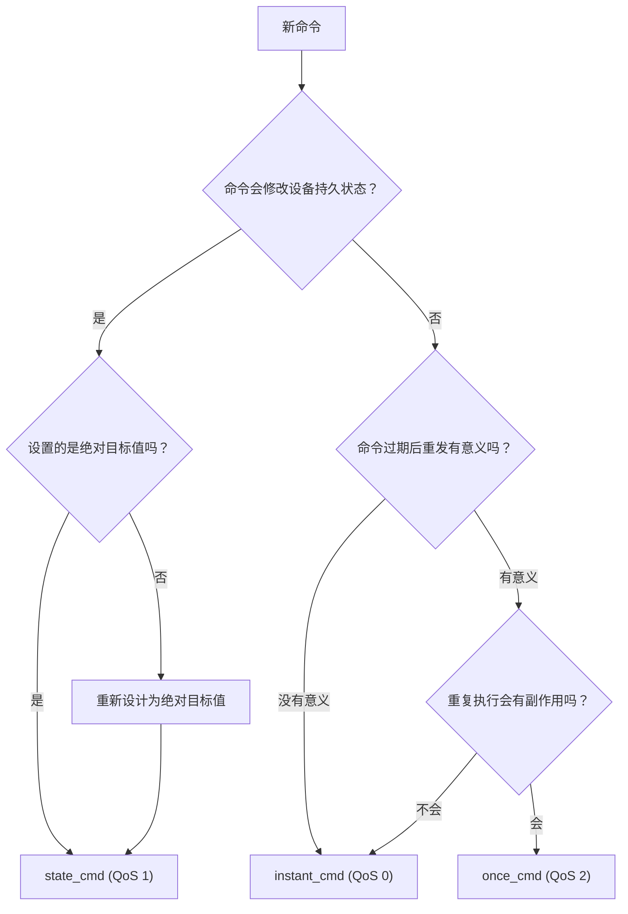
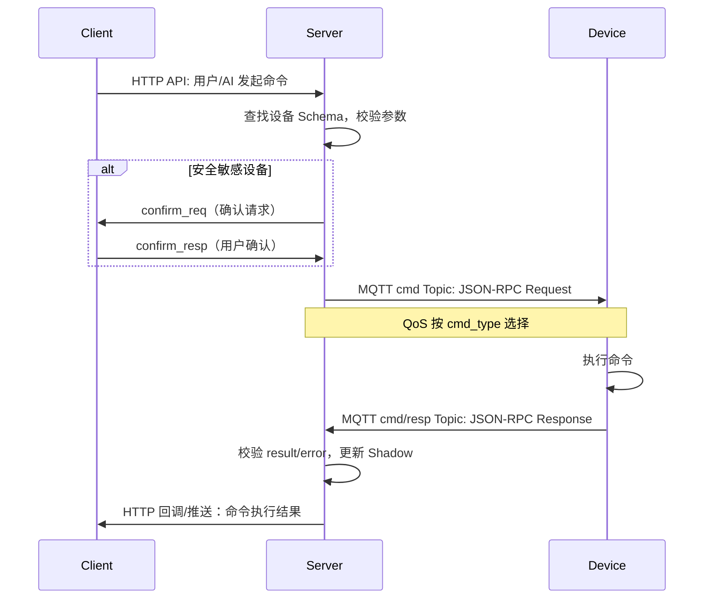
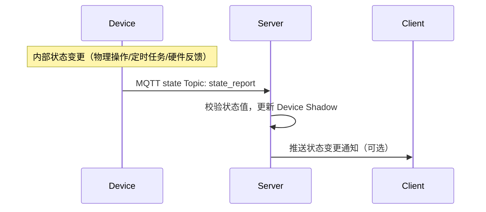
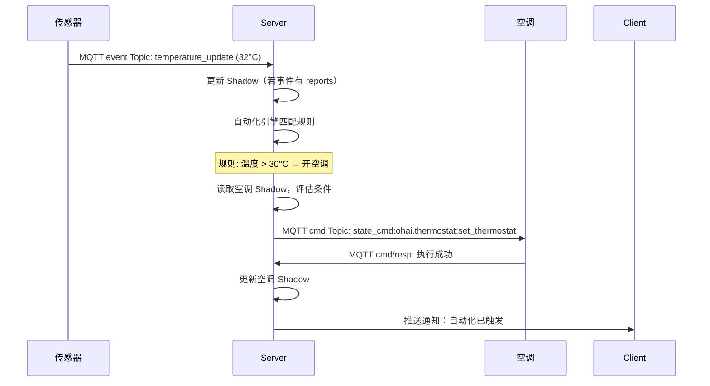
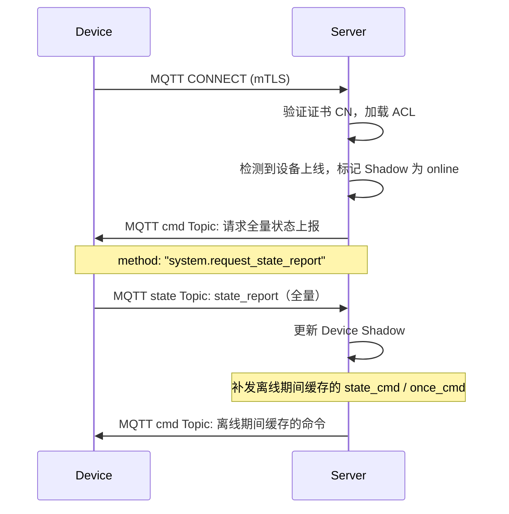
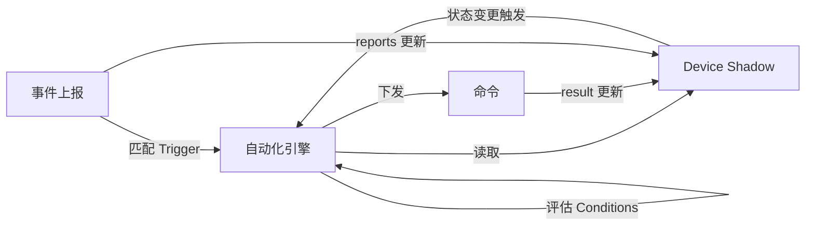

# OHAI 协议框架

本文档定义 OHAI 系统的协议运行时框架：消息格式、MQTT 主题设计、消息流程、状态同步、系统广播、错误处理和 AI 自动化集成。设备能力模型和 Schema 格式详见 [设备能力模型与 Schema 设计](./capability-model.md)，传输层安全详见 [架构安全设计](./secure-net-design.md)。

## 1. 概述

### 1.1 协议分层

```
┌─────────────────────────────────────────────────┐
│           能力层 (Capability Layer)               │  开发者定义
│  States / Commands / Events / Panel              │  schema.json
├─────────────────────────────────────────────────┤
│         消息框架层 (Message Framework Layer)       │  OHAI 协议
│  JSON-RPC 2.0 / CBOR / QoS / Topic / Shadow     │  本文档
├─────────────────────────────────────────────────┤
│           传输层 (Transport Layer)                │  OHAI 协议
│  MQTT 5.0 / mTLS 1.3 / TLS + JWT               │  secure-net-design
└─────────────────────────────────────────────────┘
```

### 1.2 角色定义

| 角色 | 说明 |
|---|---|
| **Device** | 物联网设备，通过 MQTT + mTLS 连接 Server |
| **Server** | 家庭网关（树莓派/NAS/路由器），运行 MQTT Broker + AI 引擎 + 自动化引擎 |
| **Client** | 用户终端应用（手机/平板/桌面），通过 HTTP API + TLS 连接 Server |
| **Console App** | Client 中的管理界面，完全代表用户，负责设备配网、别名设置、自动化规则管理 |

---

## 2. 消息格式

OHAI 所有 Device ↔ Server 消息均使用 [CBOR](https://www.rfc-editor.org/rfc/rfc8949.html) 序列化，遵循 [JSON-RPC 2.0](https://www.jsonrpc.org/specification) 信封格式。以下示例为便于阅读使用 JSON 表示，实际传输为 CBOR 二进制。

### 2.1 命令（Request）

Server 向 Device 下发命令。`method` 格式为 `<cmd_type>:<capability>:<command>`，三部分用 `:` 分隔（capability 键名本身含 `.`，用 `:` 避免歧义）。Server 根据 `cmd_type` 前缀自动选择 QoS 等级。

```jsonc
{
  "jsonrpc": "2.0",
  "id": "msg-a1b2c3",                                    // Server 生成的消息 ID
  "method": "state_cmd:ohai.brightness:set_brightness",   // <cmd_type>:<capability>:<command>
  "params": {
    "brightness": 80                                      // 由 Schema 中该命令的 params 定义
  }
}
```

| `cmd_type` 前缀 | QoS | 投递语义 |
|---|---|---|
| `state_cmd:*` | 1（至少一次） | 幂等，设置绝对目标状态 |
| `instant_cmd:*` | 0（至多一次） | 非幂等，实时触发，过期不补发 |
| `once_cmd:*` | 2（恰好一次） | 非幂等，关键操作，必达且不重复 |

### 2.2 命令回复（Response）

Device 执行命令后回复。成功返回 `result`，失败返回 `error`：

```jsonc
// 成功
{
  "jsonrpc": "2.0",
  "id": "msg-a1b2c3",                      // 与命令的 id 对应
  "result": {
    "brightness": 80                        // 由 Schema 中该命令的 result 定义
  }
}

// 失败
{
  "jsonrpc": "2.0",
  "id": "msg-a1b2c3",
  "error": {
    "code": -32040,                         // OHAI 错误码（封闭枚举）
    "message": "HARDWARE_FAULT"             // 与 code 严格对应的错误类型字符串
  }
}
```

### 2.3 事件（Notification）

Device 主动上报事件，使用 JSON-RPC 2.0 Notification 格式（**无 `id` 字段**）：

```jsonc
{
  "jsonrpc": "2.0",
  "method": "event:ohai.switch:physical_toggle",    // event:<capability>:<event_name>
  "params": {
    "on": false                                     // 由 Schema 中该事件的 params 定义
  }
}
```

### 2.4 状态上报（State Report）

Device 主动上报当前全量或部分状态。用于设备上线时同步、或设备内部状态变更时主动通知：

```jsonc
{
  "jsonrpc": "2.0",
  "method": "state_report",
  "params": {
    "ohai.switch": { "on": true },
    "ohai.brightness": { "brightness": 80 },
    "ohai.color_temperature": { "color_temp": 4000 }
  }
}
```

`params` 的键为能力名称，值为该能力下所有（或部分）States 的当前值。Server 收到后更新 Device Shadow。

---

## 3. 命令分类与投递语义

三种命令类型的设计理念和使用场景详见 [消息协议 - 命令分类与投递语义](./secure-message-design.md#_1-3-命令分类与投递语义)。本节聚焦于协议框架层面的投递行为。

### 3.1 命令类型选择决策

开发者在设计命令时，按以下流程选择命令类型：



### 3.2 QoS 与投递行为对照

|  | `state_cmd` | `instant_cmd` | `once_cmd` |
|---|---|---|---|
| **QoS** | 1（至少一次） | 0（至多一次） | 2（恰好一次） |
| **幂等性** | 幂等 | 非幂等 | 非幂等 |
| **离线排队** | Broker 缓存，设备上线后补发 | 不缓存，设备离线则丢弃 | Broker 缓存，设备上线后补发 |
| **重复送达** | 安全（幂等，重复执行无副作用） | 不会发生（QoS 0） | 协议保证不重复（QoS 2 四步握手） |
| **超时处理** | Server 等待回复，超时重试 | Server 不等待回复 | Server 等待回复，Broker 保证送达 |

---

## 4. MQTT Topic 设计

### 4.1 Topic 列表

所有 OHAI 协议主题以 `ohai/` 为根前缀。`{device_id}` 为设备入网时由 Console App 分配的全局唯一标识符，与 mTLS 证书 CN 字段一致。

| Topic | 方向 | QoS | 说明 |
|---|---|---|---|
| `ohai/device/{device_id}/cmd` | Server → Device | 0/1/2（按 cmd_type） | 命令下发 |
| `ohai/device/{device_id}/cmd/resp` | Device → Server | 1 | 命令回复 |
| `ohai/device/{device_id}/event` | Device → Server | 1 | 事件上报 |
| `ohai/device/{device_id}/state` | Device → Server | 1 | 状态上报（全量/增量） |
| `ohai/system/announce` | Server → All Devices | 1 | 系统广播 |

**设计决策**：

- **命令和回复分开 Topic**：`cmd` 和 `cmd/resp` 分离，设备只需订阅 `cmd`，Server 只需订阅 `cmd/resp`。这比用同一 Topic 区分方向更清晰，也方便 ACL 控制。
- **事件和状态分开 Topic**：`event` 承载异步事件（触发自动化），`state` 承载状态快照（更新 Shadow）。两者处理逻辑不同，分开 Topic 让 Server 可以用不同的处理管道高效处理。
- **业务语义在消息体内**：Topic 层级只用于路由（按 `device_id`），业务语义（命令名、事件名）在 CBOR 消息体的 `method` 字段中。这保持 Topic 结构简洁，Broker 只需按 `device_id` 做 ACL 匹配，无需解析消息内容。

### 4.2 ACL 权限控制

Server（MQTT Broker）基于 mTLS 证书 CN 字段实施 Topic 级访问控制。对于 `device_id = {id}` 的设备：

| 操作 | Topic | 允许/拒绝 |
|---|---|---|
| **订阅** | `ohai/device/{id}/cmd` | ✅ 允许 |
| **订阅** | `ohai/system/announce` | ✅ 允许 |
| **发布** | `ohai/device/{id}/cmd/resp` | ✅ 允许 |
| **发布** | `ohai/device/{id}/event` | ✅ 允许 |
| **发布** | `ohai/device/{id}/state` | ✅ 允许 |
| 订阅/发布 | `ohai/device/{other_id}/*` | ❌ 拒绝 |
| 发布 | `ohai/device/{id}/cmd` | ❌ 拒绝（防伪造命令） |
| 订阅 | `ohai/device/{id}/cmd/resp` | ❌ 拒绝 |
| 订阅 | `ohai/device/{id}/event` | ❌ 拒绝 |
| 订阅 | `ohai/device/{id}/state` | ❌ 拒绝 |
| 发布 | `ohai/system/announce` | ❌ 拒绝 |
| 其他所有 Topic | — | ❌ 拒绝 |

**核心原则**：
- **最小权限**：设备只能订阅自己的命令主题和系统广播，只能向自己的回复/事件/状态主题发布
- **方向隔离**：设备不能向自己的 `cmd` 主题发布（防伪造命令），也不能订阅自己的出站主题
- **Broker 实施**：ACL 规则在 CONNECT 阶段根据 mTLS 证书 CN 自动加载。违规请求被静默丢弃并强制断开连接

---

## 5. 消息流程

### 5.1 命令下发完整生命周期



### 5.2 状态上报流程



### 5.3 事件上报与自动化触发



### 5.4 设备上线/重连流程



---

## 6. 状态同步与设备影子（Device Shadow）

### 6.1 概念

Device Shadow 是 Server 为每台设备维护的 **状态缓存**。它是 Server 对设备当前状态的"最佳猜测"，即使设备离线也能供 Client 查询和 AI 引擎读取。

### 6.2 数据模型

Shadow 按能力组织，结构与 Schema 中的 `states` 对应：

```jsonc
{
  "device_id": "light_001",
  "online": true,
  "last_seen": "2026-03-24T10:30:00Z",
  "states": {
    "ohai.switch": { "on": true },
    "ohai.brightness": { "brightness": 80 },
    "ohai.color_temperature": { "color_temp": 4000 }
  }
}
```

### 6.3 Shadow 更新来源

Shadow 由三种消息来源更新，按优先级排序：

| 来源 | 触发时机 | 更新内容 |
|---|---|---|
| **Command Result** | `state_cmd` 执行成功，`result` 包含新状态 | 更新 `affects` 声明的状态字段 |
| **State Report** | 设备主动上报（上线同步、内部变更） | 更新上报的所有状态字段 |
| **Event (with reports)** | 事件携带状态更新（如 `physical_toggle`） | 更新 `reports` 声明的状态字段 |

### 6.4 冲突解决

当多个来源同时更新同一状态时，采用 **最后写入胜出（Last-Writer-Wins）** 策略：

- 每次更新携带 Server 端接收时间戳
- 时间戳更新的值覆盖旧值
- Command Result 和 State Report 的时间戳以 Server 接收时间为准（非设备时间）

### 6.5 Shadow 持久化

Shadow 数据持久化到本地存储，Server 重启后自动恢复。历史状态变更记录写入 DuckDB，供遥测分析和趋势图查询使用。

---

## 7. 系统广播消息

Server 通过 `ohai/system/announce` Topic 向所有设备发送系统级通知。消息使用 JSON-RPC 2.0 Notification 格式（无 `id`），QoS 1。

### 7.1 消息类型

#### `system.time_sync` — 时间同步

```jsonc
{
  "jsonrpc": "2.0",
  "method": "system.time_sync",
  "params": {
    "utc_iso8601": "2026-03-24T08:30:00Z",
    "timezone": "Asia/Shanghai"
  }
}
```

设备 **必须** 处理此消息，更新内部时钟。

#### `system.ota_available` — OTA 固件升级通知

```jsonc
{
  "jsonrpc": "2.0",
  "method": "system.ota_available",
  "params": {
    "vendor": "example-vendor",
    "product": "smart-light-bulb",
    "from_version": "1.1.0",
    "to_version": "1.2.0",
    "firmware_url": "https://ota.example.com/firmware/1.2.0.bin",
    "sha256": "abc123...",
    "size_bytes": 524288,
    "mandatory": false,
    "deadline": "2026-04-01T00:00:00Z"
  }
}
```

设备 **应当** 检查 `vendor`/`product`/`from_version` 是否匹配自身，匹配则根据策略下载并安装固件。

#### `system.server_restart` — Server 即将重启

```jsonc
{
  "jsonrpc": "2.0",
  "method": "system.server_restart",
  "params": {
    "restart_at": "2026-03-25T02:00:00Z",
    "expected_downtime_seconds": 120,
    "reason": "Scheduled maintenance"
  }
}
```

设备 **应当** 在预期停机期间缓存事件，连接恢复后重发。

#### `system.maintenance_window` — 维护窗口公告

```jsonc
{
  "jsonrpc": "2.0",
  "method": "system.maintenance_window",
  "params": {
    "start": "2026-03-25T02:00:00Z",
    "end": "2026-03-25T04:00:00Z",
    "reason": "Server firmware upgrade",
    "device_action": "retain_state"
  }
}
```

`device_action` 可选值：`retain_state`（保持当前状态）、`safe_mode`（进入安全模式）。

#### `system.emergency_shutdown` — 紧急关闭

```jsonc
{
  "jsonrpc": "2.0",
  "method": "system.emergency_shutdown",
  "params": {
    "severity": "critical",
    "affected_categories": ["all"],
    "reason": "Smoke detector triggered",
    "source_device_id": "smoke_detector_001"
  }
}
```

设备 **必须** 处理此消息。如果 `affected_categories` 包含 `"all"` 或设备所属类别，设备应进入安全状态（如关闭加热器、解锁门锁以便逃生等）。

#### `system.protocol_upgrade` — 协议版本升级提示

```jsonc
{
  "jsonrpc": "2.0",
  "method": "system.protocol_upgrade",
  "params": {
    "current_version": "2.0",
    "target_version": "2.1",
    "migration_guide_url": "https://ohai.dev/migration/2.0-to-2.1",
    "deprecation_deadline": "2026-06-01T00:00:00Z"
  }
}
```

### 7.2 设备处理要求

| 消息类型 | 处理要求 |
|---|---|
| `system.time_sync` | **MUST**：更新内部时钟 |
| `system.emergency_shutdown` | **MUST**：进入安全状态 |
| `system.ota_available` | **SHOULD**：检查并安装固件 |
| `system.server_restart` | **SHOULD**：缓存事件，重连后重发 |
| `system.maintenance_window` | **MAY**：按 `device_action` 调整行为 |
| `system.protocol_upgrade` | **MAY**：记录升级信息供 OTA 使用 |
| 未知的 `system.*` 方法 | **MUST** 忽略（向前兼容） |

---

## 8. 错误处理

### 8.1 错误码体系

OHAI 沿用 JSON-RPC 2.0 错误码体系，设备只能从预定义的封闭枚举中选取错误码，**不允许自定义错误码或附加自由文本**。这一设计确保 AI 引擎只会收到预定义的、安全的错误标识符，防止设备通过错误回复注入提示词攻击。

| 错误码范围 | 含义 |
|---|---|
| `-32700` ~ `-32600` | JSON-RPC 2.0 标准错误（协议层，Server 生成） |
| `-32000` ~ `-32046` | OHAI 设备错误（设备回复，封闭枚举） |

错误码基于 **命令执行管线** 模型设计——命令从到达设备到执行完成必须依次通过消息解码、命令路由、参数校验、能力检查、前置条件、资源获取、物理执行七个阶段。每个阶段的失败模式被穷举后分配错误码，确保错误码集合的完备性。

完整的错误码定义、分类规则、重试策略和 AI 安全设计详见 [错误码规范](./error-codes.md)。

### 8.2 超时处理

| 命令类型 | Server 端超时行为 |
|---|---|
| `state_cmd` | 等待回复，超时（默认 10s，可配置）后重试一次（QoS 1 保证送达）。最终超时后报告 Client 命令失败。 |
| `instant_cmd` | 不等待回复（QoS 0 fire-and-forget）。Server 在发送后即视为"已发出"，不保证送达。 |
| `once_cmd` | Broker 级保证送达（QoS 2）。Server 设最大等待时间（默认 60s），超时后不重试（防止重复执行），报告 Client。 |

### 8.3 设备离线时的命令处理

| 命令类型 | 设备离线时行为 |
|---|---|
| `state_cmd` | Broker 缓存（MQTT Retained/Queued Message），设备上线后自动补发。多条同一命令仅保留最后一条（幂等）。 |
| `instant_cmd` | 丢弃。过期的即时命令在设备上线后重发是错误的。 |
| `once_cmd` | Broker 缓存，设备上线后按序补发。QoS 2 保证不重复。 |

---

## 9. AI 自动化集成

### 9.1 自动化规则模型：Trigger → Condition → Action

用户通过 Console App 使用自然语言定义自动化规则。Server 中的 Main Agent 通过 LLM 将自然语言解析为结构化规则对象。

**规则结构**：

```jsonc
{
  "rule_id": "rule_001",
  "name": "高温自动开空调",
  "trigger": { /* 触发条件 */ },
  "conditions": [ /* 附加条件（可选） */ ],
  "actions": [ /* 执行动作 */ ]
}
```

### 9.2 Trigger 类型

#### 事件触发（Event Trigger）

当设备上报特定事件时触发：

```jsonc
{
  "type": "event",
  "device_id": "temp_sensor_123",
  "capability": "ohai.sensor.temperature",
  "event": "temperature_update",
  "filter": "params.temperature > 30"
}
```

#### 状态变更触发（State Trigger）

当 Device Shadow 中某个状态值发生变化时触发：

```jsonc
{
  "type": "state_change",
  "device_id": "front_door_lock_789",
  "capability": "ohai.lock",
  "state": "locked",
  "from": true,
  "to": false
}
```

#### 定时触发（Timer Trigger）

基于 Cron 表达式定时触发：

```jsonc
{
  "type": "timer",
  "schedule": "0 7 * * *"       // 每天早上 7 点
}
```

#### 复合触发（Compound Trigger）

多个触发条件的逻辑组合：

```jsonc
{
  "type": "compound",
  "operator": "AND",
  "triggers": [ /* 多个 trigger */ ]
}
```

### 9.3 Condition 评估

Conditions 在 Trigger 命中后执行评估，所有 Conditions 为 true 时才执行 Actions：

```jsonc
"conditions": [
  {
    "type": "state",
    "device_id": "ac_456",
    "capability": "ohai.switch",
    "state": "on",
    "operator": "eq",
    "value": false                    // 空调当前为关闭状态
  },
  {
    "type": "time_window",
    "after": "06:00",
    "before": "23:00"                 // 在 6:00-23:00 之间
  }
]
```

Conditions 从 Device Shadow 读取设备状态，**不直接查询设备**，确保评估速度。

### 9.4 Action 类型

#### 命令下发

```jsonc
{
  "type": "command",
  "device_id": "ac_456",
  "capability": "ohai.thermostat",
  "command": "set_thermostat",
  "params": {
    "target_temp": 24,
    "mode": "cool"
  }
}
```

Server 按命令的 `cmd_type` 选择 QoS 等级下发。

#### 通知推送

```jsonc
{
  "type": "notify",
  "message": "客厅温度超过 30°C，已自动开启空调"
}
```

通过 Client HTTP 推送通知用户。

#### AI 推理

```jsonc
{
  "type": "ai_inference",
  "prompt": "根据当前所有传感器数据，判断是否需要调整全屋温控"
}
```

调用 LLM 进行复杂决策，LLM 可进一步生成命令下发。

### 9.5 状态-事件-命令协作闭环

自动化引擎的核心是 **状态、事件、命令三者的协作循环**：



**完整流程示例**：

1. 温湿度传感器上报 `temperature_update` 事件（`temperature: 32`）
2. 事件声明 `reports: [temperature]` → Server 更新传感器的 Shadow
3. 自动化引擎匹配规则 "温度 > 30°C → 开空调"
4. 读取空调 Shadow 的 `ohai.switch:on` 状态 → `false`（空调当前关闭）
5. Conditions 全部满足 → 执行 Action
6. 下发 `state_cmd:ohai.thermostat:set_thermostat`（`{ "target_temp": 24, "mode": "cool" }`）
7. 空调回复成功 → Server 更新空调的 Shadow
8. 通知 Client："已自动开启空调，目标温度 24°C"

### 9.6 自动化规则完整示例

#### 示例 1：高温自动开空调

"当温湿度传感器上报温度超过 30°C 时，自动打开空调并设置到 22°C。"

```jsonc
{
  "rule_id": "rule_001",
  "name": "高温自动开空调",
  "trigger": {
    "type": "event",
    "device_id": "temp_sensor_123",
    "capability": "ohai.sensor.temperature",
    "event": "temperature_update",
    "filter": "params.temperature > 30"
  },
  "conditions": [],
  "actions": [
    {
      "type": "command",
      "device_id": "ac_456",
      "capability": "ohai.thermostat",
      "command": "set_thermostat",
      "params": { "target_temp": 22, "mode": "cool" }
    }
  ]
}
```

#### 示例 2：深夜开门告警

"当门锁被物理切换到开状态，并且当前时间在晚上 10 点到早上 6 点之间时，发送通知并打开客厅主吊灯的夜灯模式。"

```jsonc
{
  "rule_id": "rule_002",
  "name": "深夜开门告警",
  "trigger": {
    "type": "state_change",
    "device_id": "front_door_lock_789",
    "capability": "ohai.lock",
    "state": "locked",
    "from": true,
    "to": false
  },
  "conditions": [
    {
      "type": "time_window",
      "after": "22:00",
      "before": "06:00"
    }
  ],
  "actions": [
    {
      "type": "notify",
      "message": "前门在深夜被打开了！"
    },
    {
      "type": "command",
      "device_id": "living_room_light_123",
      "capability": "ohai.brightness",
      "command": "set_brightness",
      "params": { "brightness": 30 }
    },
    {
      "type": "command",
      "device_id": "living_room_light_123",
      "capability": "ohai.color_temperature",
      "command": "set_color_temp",
      "params": { "color_temp": 2700 }
    }
  ]
}
```

#### 示例 3：每日定时暖房

"每天早上 7 点，如果客厅温度低于 15°C，就打开空调并设置到 24°C，将燃气热水器调整为自动加热模式。"

```jsonc
{
  "rule_id": "rule_003",
  "name": "每日定时暖房",
  "trigger": {
    "type": "timer",
    "schedule": "0 7 * * *"
  },
  "conditions": [
    {
      "type": "state",
      "device_id": "living_room_temp_sensor_123",
      "capability": "ohai.sensor.temperature",
      "state": "temperature",
      "operator": "lt",
      "value": 15
    }
  ],
  "actions": [
    {
      "type": "command",
      "device_id": "ac_456",
      "capability": "ohai.thermostat",
      "command": "set_thermostat",
      "params": { "target_temp": 24, "mode": "heat" }
    },
    {
      "type": "command",
      "device_id": "water_heater_789",
      "capability": "ohai.thermostat",
      "command": "set_thermostat",
      "params": { "mode": "auto" }
    }
  ]
}
```

### 9.7 规则冲突检测

当多条规则可能同时触发并向同一设备发送矛盾的命令时（例如一条规则要开空调制冷，另一条要开制热），Server 采用以下策略：

1. **时间戳优先**：后触发的规则覆盖先触发的规则（`state_cmd` 幂等，最后到达的目标值生效）
2. **用户优先级**：用户可以为规则设置优先级（1-10），冲突时高优先级规则优先
3. **冲突告警**：Server 检测到矛盾命令时通知 Client，由用户决定

### 9.8 自动化规则权限控制

OHAI 的能力模型在架构层面已将每个能力设计为单一职责、按能力粒度引用、事件按能力隔离，从根源上避免了某些智能家居平台中"获得设备一个能力即自动获得该设备所有能力"的粗粒度绑定问题。然而，自动化规则作为无人值守的程序化执行路径，仍需额外的权限约束以遵循**最小特权原则**。

#### 问题：命令风险不对称

同一能力内的命令可能存在风险不对称。例如 `ohai.lock` 的 `set_locked` 命令接受 `locked: boolean` 参数：

- `set_locked({ locked: true })` → 锁门，最坏后果是造成不便（被锁在门外）
- `set_locked({ locked: false })` → 开锁，可能导致非法入侵

用户在编写自动化规则时可能犯错——写出"当某条件满足时自动开门"这样的危险规则，或者在参数中误写 `locked: false`。**安全不能依赖用户自律，必须由协议层强制保障。**

#### 标准能力中的自动化安全策略（`automation_policy`）

OHAI 在**标准能力定义本身**中声明每个命令的自动化安全策略。这是能力 Schema 的一部分，由 OHAI 标准库定义，开发者和用户均无法绕过。

命令定义中新增 `automation_policy` 字段：

| 策略 | 含义 | 自动化行为 |
|---|---|---|
| `allow` | 常规操作（默认） | 自动化可直接执行 |
| `confirm` | 需要用户确认 | 自动化触发时暂停执行，推送确认请求到 Console App，用户确认后才下发 |
| `deny` | 禁止自动化执行 | Server 无条件拦截，该命令只能由用户在 Console App 中手动操作 |

当 `automation_policy` 需要根据参数值区分安全等级时，使用 `automation_policy_by_params` 进行**参数级策略声明**：

```yaml
ohai.lock:
  description: 门锁控制
  states:
    locked:
      type: boolean
      description: 是否已锁定
      semantic: lock_state
  commands:
    set_locked:
      cmd_type: state_cmd
      affects: [locked]
      description: 设置锁定状态
      automation_policy_by_params:
        - when: { locked: true }           # 锁门
          policy: allow                     # 自动化可直接执行
        - when: { locked: false }          # 开锁
          policy: confirm                   # 自动化需用户确认（厂商/用户可通过覆盖升级到 deny）
      params:
        type: object
        properties:
          locked: { type: boolean }
        required: [locked]
        additionalProperties: false
```

`when` 使用 JSON Schema 子集语法匹配参数值。匹配规则：

- 多条 `when` 按声明顺序匹配，**首条命中生效**
- 未命中任何 `when` 的参数组合，回退到命令级 `automation_policy`（默认 `allow`）
- `automation_policy` 与 `automation_policy_by_params` 可共存，前者作为后者的回退默认值

#### 更多示例

**烤箱**：开启危险、关闭安全

```yaml
example-vendor.oven:
  commands:
    set_on:
      cmd_type: state_cmd
      affects: [on]
      automation_policy_by_params:
        - when: { on: true }               # 开启烤箱
          policy: confirm                   # 自动化需用户确认
        - when: { on: false }              # 关闭烤箱
          policy: allow                     # 自动化可直接执行
```

**温控**：正常范围自动化可执行，极端值需确认

```yaml
ohai.thermostat:
  commands:
    set_thermostat:
      cmd_type: state_cmd
      affects: [target_temp, mode]
      automation_policy: allow              # 默认允许
      automation_policy_by_params:
        - when:                             # 目标温度超过 35°C
            target_temp: { minimum: 35 }
          policy: confirm                   # 需要用户确认
```

#### Server 端程序化校验

安全策略的执行完全在 Server 端，用户和自动化规则无法绕过：

**规则创建时（静态分析）**：

1. Server 解析规则中每个 Action 的 `capability` + `command` + `params`
2. 将参数与对应命令的 `automation_policy_by_params` 逐条匹配
3. 如果参数是硬编码值且命中 `deny` 策略 → **拒绝创建规则**，返回错误提示告知用户该操作禁止自动化
4. 如果参数是硬编码值且命中 `confirm` 策略 → 允许创建，标记该 Action 为"需确认"

**规则执行时（运行时拦截）**：

1. 自动化引擎在下发每条命令前，将**实际参数**与 `automation_policy_by_params` 匹配
2. 命中 `deny` → **拦截**，不下发命令，记录安全日志，通知用户
3. 命中 `confirm` → **暂停**，推送确认请求到 Console App，等待用户确认后下发（超时则取消）
4. 命中 `allow` 或无匹配 → 正常下发

```
规则创建 ──► 解析 Actions ──► 匹配 automation_policy ──► deny: 拒绝创建
                                                        ──► confirm: 标记需确认
                                                        ──► allow: 正常存储

规则触发 ──► Condition 评估 ──► 组装参数 ──► 匹配 automation_policy ──► deny: 拦截 + 通知
                                                                      ──► confirm: 暂停 + 等待确认
                                                                      ──► allow: 下发命令
```

运行时校验对动态参数（如引用触发事件中的数据）尤为关键——创建时的静态分析无法覆盖所有运行时值。

#### 设计原则

1. **标准能力定义安全下限**：`automation_policy` 写在 `ohai.*` 标准能力库中，设定每条命令的最低安全等级。厂商和用户只能在此基础上升级策略，不能降级
2. **默认安全**：标准能力中安全敏感的命令/参数组合默认标记为 `deny` 或 `confirm`，用户不做任何配置也能获得保护
3. **厂商自定义能力同样适用**：厂商在自定义能力中声明 `automation_policy`，Server 统一执行。未声明策略的命令默认为 `allow`
4. **用户手动操作不受限制**：`automation_policy` 仅约束自动化引擎。用户在 Console App 中手动操作设备时，所有命令均可执行（通过 [5.1 节](#_5-1-命令下发完整生命周期)的正常命令流程下发）

#### 三层策略覆盖模型

`automation_policy` 的生效策略由三层叠加决定，每层只能升级（加严）不能降级（放宽）：

```
effective_policy = max(standard_policy, vendor_override, user_override)

策略严格度排序：allow < confirm < deny
```

| 层级 | 时机 | 谁设置 | 存储位置 |
|---|---|---|---|
| **标准能力定义** | 协议设计时 | OHAI 标准库 | 标准能力库（安全下限，不可降级） |
| **厂商 Schema 覆盖** | 设备注册时 | 设备开发者 | 设备 `schema.json` 的 `overrides.commands` |
| **用户设备配置** | 运行时 | 用户（Console App） | Server 端设备配置数据库 |

**厂商覆盖**通过 Schema `overrides` 机制实现（详见 [设备能力模型 - 覆盖标准能力的部分约束](./capability-model.md#_4-2-capability-引用与定义)），在设备注册时由 Server 校验并合并。

**用户覆盖**通过 Console App 的设备设置界面配置。Console App 展示该设备所有命令的当前生效策略（`max(standard, vendor)`），用户只能选择当前值或更严格的值。覆盖存储在 Server 端设备配置中，不影响设备 Schema。

**示例**：

```
ohai.lock — set_locked
├── locked: true
│   ├── 标准定义:    allow
│   ├── 厂商覆盖:    (无)
│   ├── 用户覆盖:    (无)
│   └── 生效策略:    allow
│
└── locked: false
    ├── 标准定义:    confirm
    ├── 厂商覆盖:    deny     ← 高安全门锁厂商升级
    ├── 用户覆盖:    (无)
    └── 生效策略:    deny      = max(confirm, deny)
```

### 9.9 遥测数据存储

OHAI Server 内置 DuckDB 作为遥测数据的时序存储引擎。DuckDB 为嵌入式列式数据库，适合在边缘设备（树莓派、NAS、路由器）上运行分析查询。

所有设备状态变更和事件上报都持久化到 DuckDB，支持：
- Console App 中的历史数据查询和趋势图渲染（[Adaptive Cards OhaiChart](./capability-model.md#_10-4-趋势图扩展元素)）
- AI 引擎基于历史数据的模式识别和预测
- 用户通过自然语言查询历史数据（如"最近一周客厅温度变化趋势"）

---

## 10. Schema 校验时机

Server 在以下环节执行校验，确保消息一致性：

| 时机 | 校验内容 | 详情 |
|---|---|---|
| **设备注册** | Meta-Schema + 语义校验 + Panel 校验 | 见 [能力模型 - Schema 校验规则](./capability-model.md#_7-schema-校验规则与元-schema) |
| **命令下发前** | `params` 校验 | AI 引擎生成的参数经对应命令的 `params` Schema 校验后才封装为 JSON-RPC Request |
| **回复接收时** | `result` / `error` 校验 | 不合法的回复被丢弃并记录日志（错误码校验规则见 [错误码规范](./error-codes.md#_5-1-校验与丢弃)） |
| **事件接收时** | 事件 `params` 校验 | 不合法的事件被丢弃并记录日志 |
| **状态上报时** | 状态值类型校验 | 上报的值须符合 Schema 中 State 的类型定义 |
